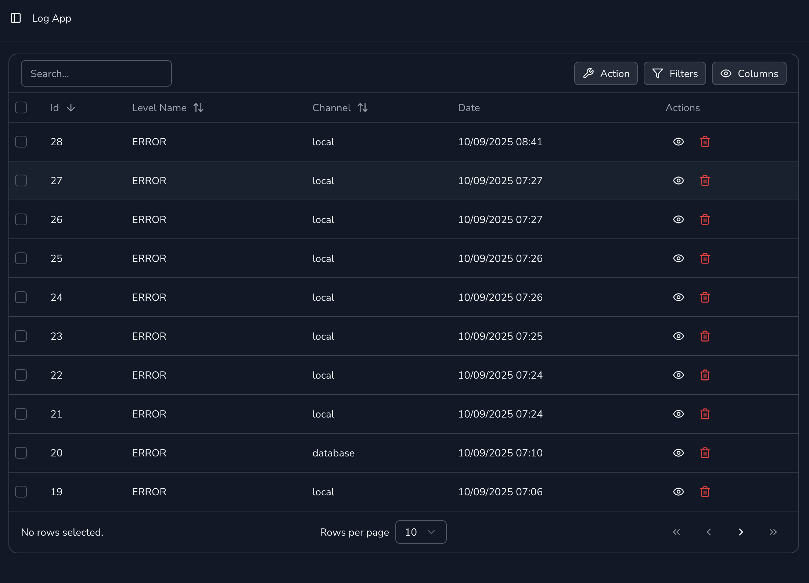

# Laravel Database Logger

[](https://packagist.org/packages/jhonoryza/laravel-database-logger) [](https://packagist.org/packages/jhonoryza/laravel-database-logger) [](https://packagist.org/packages/jhonoryza/laravel-database-logger) [](https://packagist.org/packages/jhonoryza/laravel-database-logger) [](https://packagist.org/packages/jhonoryza/laravel-database-logger)

This package provides ability to store laravel log to the database table.

## Requirement

- PHP 8.1 - 8.4
- Laravel 9, 10, 11, 12

## Getting Started

1. install

```bash
composer require jhonoryza/laravel-database-logger
```

2. publish config files

```bash
php artisan vendor:publish --tag laravel-database-logger
```

3. check the `logging-db` config file and change logger db connection.

4. it is recommended to use different database connection from the main used one.

5. after package is installed, you can run `php artisan migrate` to create table `logs_app` and `logs_api`

6. then modify `logging.php`

    - add `database` channel to the `stack` channel

    ```php
    <?php
        'stack' => [
            'driver' => 'stack',
            'channels' => ['daily', 'database'],
            'ignore_exceptions' => true,
        ],
    ```

    - add in `.env` file to set `DB_CONNECTION_LOGGER=pgsql`

---

## Additional API Logger

register the macro

```php
<?php

use Jhonoryza\DatabaseLogger\Logging\ApiLogger;

class ServiceProvider
{
    public function boot()
    {
        ApiLogger::registerMacro();
    }
}
```

to automatically add api logger to the database call `logRequest` function

```php
<?php

use Illuminate\Support\Facades\Http;

$response = Http::logRequest()
    ->withHeaders(['X-Foo' => 'Bar'])
    ->post('https://api.example.com/v1/users?id=123', [
        'name' => 'Fajar',
    ]);
```

## Additional Repository

```php
<?php

use Jhonoryza\DatabaseLogger\Repositories\LogAppRepository;
use Jhonoryza\DatabaseLogger\Repositories\LogApiRepository;

LogAppRepository::getAllList(limit: 10);
LogAppRepository::getSimplePaginateList(perPage: 10);
LogAppRepository::getPaginateList(perPage: 10);
LogAppRepository::getCursorList(perPage: 10);
LogAppRepository::getDetail(id: 1);

LogApiRepository::getAllList(limit: 10);
LogApiRepository::getSimplePaginateList(perPage: 10);
LogApiRepository::getPaginateList(perPage: 10);
LogApiRepository::getCursorList(perPage: 10);
LogApiRepository::getDetail(id: 1);
```

## Screenshot




## Security

If you've found a bug regarding security, please mail [jardik.oryza@gmail.com](mailto:jardik.oryza@gmail.com) instead of
using the issue tracker.

## License

The MIT License (MIT). Please see [License File](license.md) for more information.
